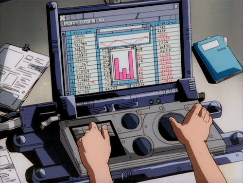

# Desafio 5

- Devido aos efeitos da globalização e visando o lucro, uma rede de caixas de supermercado resolveram adotar diversas moedas diferentes, tais como dolar e euro, pensando nisso desenvolva um programa que calcule automáticamente a conversão da moeda.

O programa tem que fazer as seguintes conversões:

- [x] Real para euro
- [x] Real para dolar
- [ ] Euro para real
- [ ] Dolar para real
- [ ] Euro para dolar
- [ ] Dolar para euro

Exemplo

```python
real_para_euro = 6.5
real_para_dolar = 5.0

real = float(input('Digite o valor em reais'))
print(f'{real} reais é equivalente a {real*real_para_dolar} dólares e {real*real_para_euro}')
print()
```

[Lista de atividades](./../python.md)

